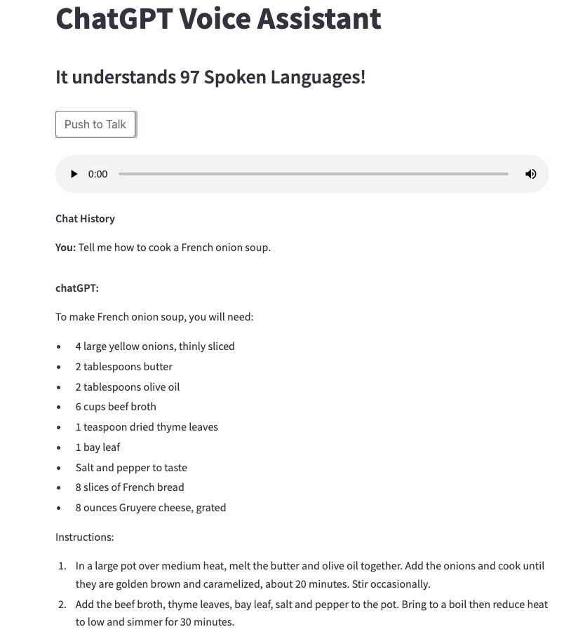

# ChatGPT Voice Assistant Understanding 97 Languages

This is a ChatGPT voice assistant web app that understands 97 different spoken languages. It is backed by the [awesome open sourced Whisper Automatic Speech Recogntion (ASR) model](https://github.com/openai/whisper) and the chatGTP Large Language Model (LLM), both provided by OpenAI. 

You can click the "Push-To-Talk" button in the web app to ask ChatGPT about anything you are interested in many different languages. This web app will transcribe what you said and then send the request to OpenAI's chatGPT API to get the answer. And then it will then speak out chatGPT's answer using computer synthetic voice back to user.

This repository includes sample code from my first book in the ***HOW-TO-DO-AI book series***, "AI/ML Web App Development for Everyone: A 5-Day Guide for Non-Coders to Build a Voice Assistant that Understands 97 Languages" listed at [Kindle](https://www.amazon.com/dp/B0BX5BGQ5R) and [Gumroad](https://mingkuan.gumroad.com/l/cxfra) . The book is intended for everyone, including non-coders without a technology background, who want to develop an AI/ML web app quickly and easily.


**Note**:
You need get your own OpenAI API key in order to let the web app to get response from the chatGPT API.

# How to get your own OpenAI API keys
1. Log in to the [OpenAI website](https://openai.com/)
2. Click on your profile picture in the top right corner and select "Dashboard"
3. In the Dashboard, click on "API keys" in the left-hand menu
4. You should see a list of API keys associated with your account. If you haven't generated an API key yet, you can do so by clicking the "New API key" button.

# Running the voice assistant web app

## 1. Run from source code directly
```bash
#checkout the source codes
git clone https://github.com/mingkuan/voice-assistant-chatgpt.git

#install dependencies
pip install -r requirements.txt

#get your OpenAI API key from: https://platform.openai.com/account/api-keys 
#feedin your own OpenAI API key in line#57 in the voicechat.py file.

#start the web app
streamlit run voicechat.py
```
And then open your browser with the URL at http://localhost:8501

## 2. Run from docker container

```bash
# Build the docker container
docker build -t voicebot-chatgpt -f Dockerfile .

# Save your own OpenAPI key into your secret file .env.secrete.txt

# Run the docker container by feed in your API key as environment variable
docker run -it -p 8501:8501  --env-file .env.secrete.txt voicebot-chatgpt
```
And then open your browser with the URL at http://localhost:8501

## 3. Screenshot of the Voice Assistant of chatGPT


